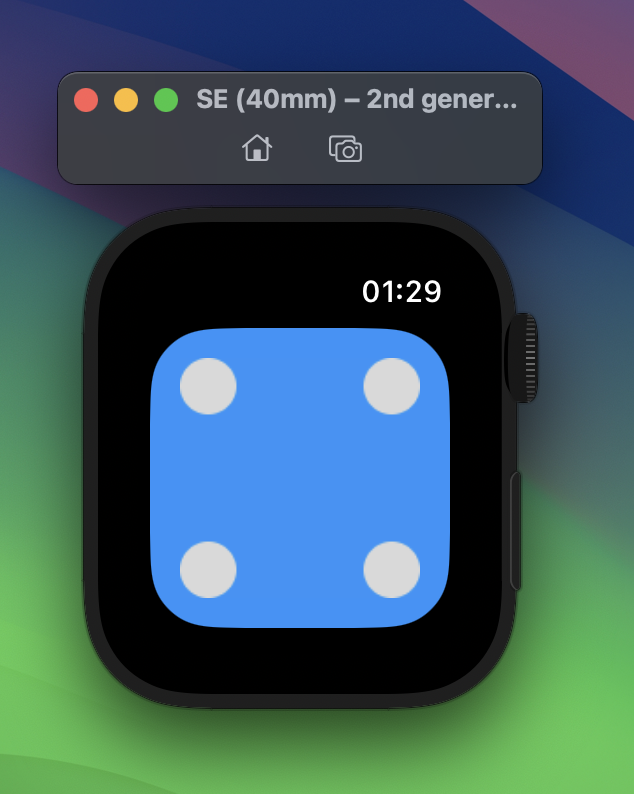

# 🎲 Dice Roll — Apple Watch App

A minimal dice roller for Apple Watch.  
Tap the screen — get a result. That's it.

Built as a first experiment with WatchOS development.

---

## 🎮 How It Works

- Tap anywhere on screen to roll
- Dice animates with a quick rotation shake
- Supports wrist-shake gesture via `deviceDidShake`
- Result: 1–6, displayed as a dice face image

---

## 🛠 Built With

- **Platform:** watchOS
- **Language:** Swift
- **Framework:** SwiftUI + CoreMotion

---

## 💼 Context

Pet project — wanted to try WatchOS development.  
Part of an ongoing interest in building small, focused Apple Watch apps.
